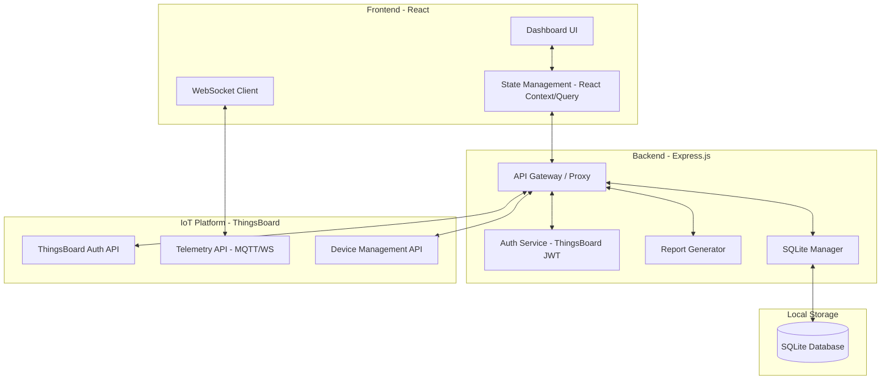

# Factory OEE Dashboard Architecture

## 1. System Architecture Diagram



## 2. Technology Stack Recommendation

| Layer | Technology | Reason |
| :--- | :--- | :--- |
| **Frontend** | **React 19** | Industry standard, excellent ecosystem for dashboards (Recharts, Lucide). |
| **Styling** | **Tailwind CSS** | Rapid UI development with utility classes, easy dark mode support. |
| **Backend** | **Express.js** | Lightweight, perfect for proxying IoT APIs and managing SQLite. |
| **Database** | **SQLite** | Required by prompt; excellent for local reporting and historical summaries. |
| **Real-time** | **WebSockets** | Essential for low-latency telemetry updates from ThingsBoard. |
| **Visualization** | **Recharts** | Declarative, React-friendly charting library. |

## 3. Database Schema (SQLite)

```sql
-- Production Planning
CREATE TABLE production_plans (
    id INTEGER PRIMARY KEY AUTOINCREMENT,
    device_id TEXT NOT NULL,
    target_quantity INTEGER,
    start_time DATETIME,
    end_time DATETIME,
    status TEXT DEFAULT 'planned' -- planned, active, completed
);

-- Downtime Tracking
CREATE TABLE downtime_events (
    id INTEGER PRIMARY KEY AUTOINCREMENT,
    device_id TEXT NOT NULL,
    reason TEXT,
    start_time DATETIME,
    end_time DATETIME,
    duration_minutes INTEGER,
    category TEXT -- mechanical, electrical, operator, etc.
);

-- OEE Historical Summaries (Aggregated hourly/daily)
CREATE TABLE oee_summaries (
    id INTEGER PRIMARY KEY AUTOINCREMENT,
    device_id TEXT NOT NULL,
    timestamp DATETIME DEFAULT CURRENT_TIMESTAMP,
    availability REAL,
    performance REAL,
    quality REAL,
    oee_score REAL
);

-- Device Metadata (Local cache/extension)
CREATE TABLE device_config (
    device_id TEXT PRIMARY KEY,
    display_name TEXT,
    ideal_cycle_time REAL, -- seconds per unit
    location TEXT
);
```

## 4. API Integration Strategy

1.  **Backend Proxy**: The Express server acts as a middleware. Frontend requests `/api/telemetry` -> Backend adds ThingsBoard JWT -> Backend calls `iot1.wsa.cloud`. This secures the ThingsBoard credentials.
2.  **Telemetry Polling/WS**: Use ThingsBoard's WebSocket API for real-time "Live" updates on the dashboard.
3.  **Batch Processing**: A background task in Express periodically fetches telemetry from ThingsBoard and aggregates it into the SQLite `oee_summaries` table for fast historical reporting.

## 5. Authentication Flow

1.  **Login**: User enters credentials (e.g., `oee1@gmail.com`) in the React UI.
2.  **Token Exchange**: React sends credentials to Express `/api/auth/login`.
3.  **ThingsBoard Auth**: Express calls ThingsBoard `/api/auth/login`.
4.  **Session Management**: ThingsBoard returns a JWT. Express stores this in a secure HTTP-only cookie or returns it to the client.
5.  **Authorized Requests**: Subsequent requests use this JWT to interact with ThingsBoard APIs.
